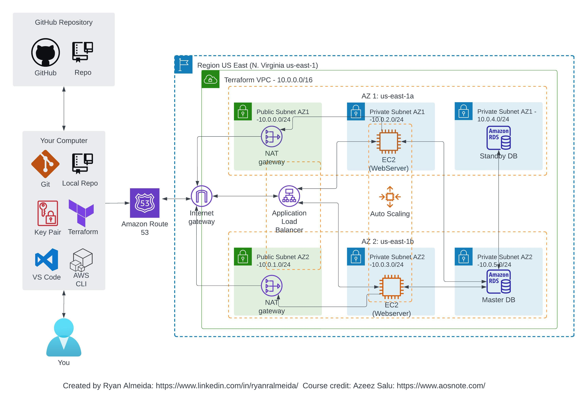

# Deploy a Dynamic Website on AWS with Terraform 

## A fully functional EXAMPLE cloud project deployed on AWS to practice implementing Infrastructure as Code (IaC) tools and services, including Terraform  

This project is an example that was built along with a tutorial series from AOSNOTE (www.aosnote.com) that teaches you how to use Terraform to create a dynamic website on AWS. This project allows you to appreciate the strength of deploying Infrastucture as code (Iac), which include:

1. Repeatability, and the ability to provision pre-configured environments, offering consistency
2. Decreasing Risk due to human error which may lead to uneccessary troubleshooting and debugging
3. Increasing Security and Faster Recovery in the event of an unecpected attack
4. Faster deployment and execution due to pre-configured enviroments
5. Greater control and situational awareness due to deployments from pre-configured environments
6. Financial savings due to ability to deploy and destroy resources on demand 

In particular, this project will be deplyoed by completing the following steps:

- Terraform overview and setup instructions
- Setting up remote backend in AWS using S3 bucket
- [Optional] Setting up a GitHup profile and repository, installing Git, Visual Studio Code, and AWS CLI to ease access, management and deployment of code
- Writing Terraform syntax to create resources in AWS, which include:
  - Understanding the basic syntax of Terraform init, plan, apply and destroy
  - Creating variables and inputs which enable Terraform configurations to be flexible and composable
  - Creating a VPC (including public/private subnets in multiple Availability Zones)
  - Creating NAT Gateways
  - Creating Security Groups
  - Creating an RDS Instance
  - Creating an EC2 Instance
  - Creating Application Load Balancers and Auto Scaling Groups
  - Creating record sets in Route 53 and AWS Certificate Manager to customize DNS route and secure the website 
- Destroying resources and cleaning up the enviroment

## Architectural Diagram:

## Learning Outcomes:
- Creating and deploying a web application through Terraform was useful in understanding the various advantages of Infrastructure as Code (IaC). By utilizing Terraform, you gain hands-on experience with IaC principles, allowing you to provision and manage cloud resources in a declarative manner. 
- Setting up a remote backend in AWS using S3 bucket enables secure storage and versioning of Terraform state files, facilitating collaboration and reproducibility. 
- Establishing a GitHub profile and repository, installing Git, Visual Studio Code, and AWS CLI foster good development practices and tooling integration, enhancing code management and deployment processes. 
- Writing Terraform configurations using its syntax helps you understand the lifecycle of Terraform commands (init, plan, apply, destroy) and empowers you to provision and manage complex infrastructure resources. 
- Creating variables and inputs in Terraform allows for configurable and reusable configurations, enhancing flexibility and composability. 
- Deploying resources such as VPCs, subnets, NAT Gateways, Security Groups, RDS instances, EC2 instances, Load Balancers, and Auto Scaling Groups enables you to comprehend the provisioning and orchestration of cloud infrastructure components
- Configuring Route 53 and AWS Certificate Manager for DNS routing and securing the website provides insights into domain management and SSL certificate integration. 
- Finally, the ability to destroy resources and clean up the environment reinforces best practices for managing cloud resources and cost optimization. 
- Overall, this project equips you with essential skills in IaC, cloud infrastructure provisioning, resource management, automation, version control, and collaboration, enabling you to efficiently deploy and manage infrastructure at scale.